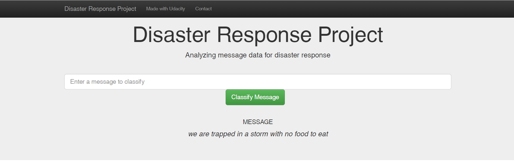
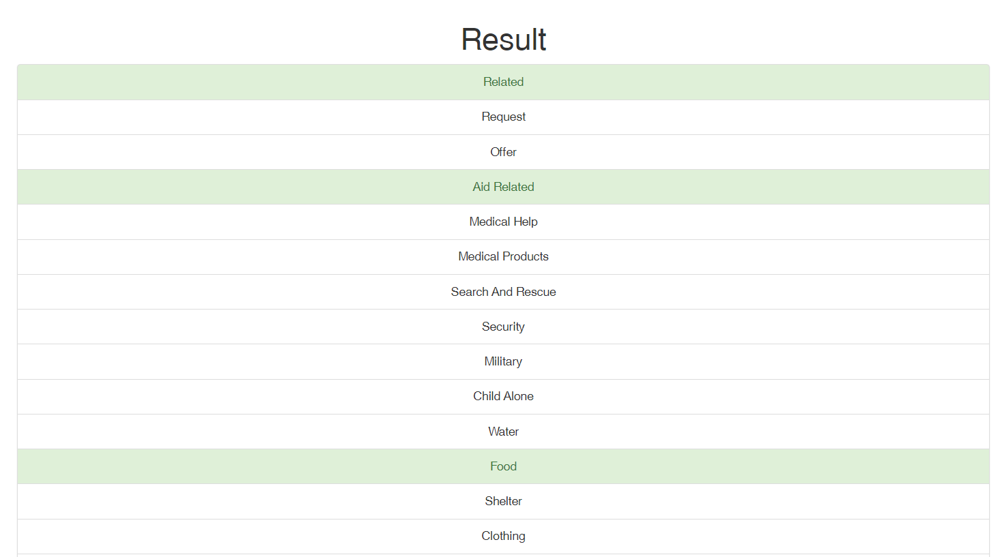
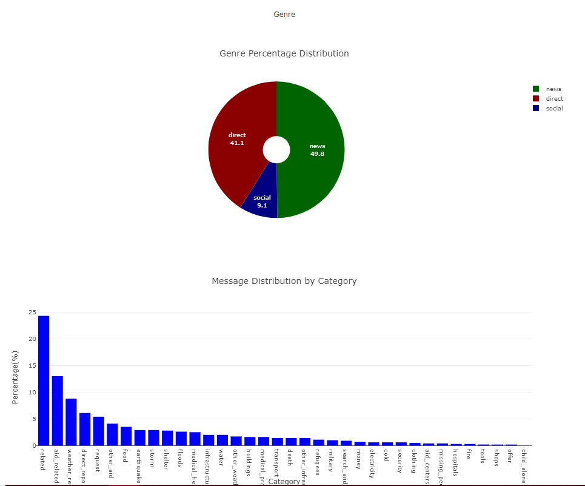

# disaster-response-pipelines

### Table of Contents

1. [Installation](#install)

2. [Project Motivation](#motive)

3. [File Description](#desc)

4. [Screenshots](#rslts)

5. [Licensing, Authors, Acknowledgements](#ack)

## Installation
The project was written primarily in Python 3  and the libraries used are provided in the Anaconda Distribution in addition to the following:
nltk,
Flask, Plotly,
pickle, re,
SQLalchemy

## Project Motivation
This project aims to assist emergency aid workers to quickly respond to emergency situations during a disaster.
The app classifies pre-labeled texts and categorizes each to be sent to the appropriate emergency response team.
It does this in the below steps.

  1. Cleans and processed raw texts and saves it to a database
  
  2. Builds and trains a model based on the processed data which can classify new messages into aprropriate categories 
  
  3. Deploy model as web app to assit end user in classifying emergency messages

## File Description
**process_data.py:** Python module to perform ETL pipeline

**ETL Pipeline Preparation.ipynb:** Notebook to prepare final code for ETL module

**train_classifier.py:** Python module to for ML pipeline. Builds and trains classifier model based on data from ETL pipeline

**ML Pipeline Preparation.ipynb:** Notebook to prepare final code for ML module

**run.py:** Module to launch Flask web app

**go.html/master.html** html files for web app

**disaster_categories.csv/disaster_messages.csv** raw data containing messages

**Disaster_Response_Data.db** Output DB of ETL pipeline

**classifier.pkl** Output classifier model of ML pipeline

## Screenshots

## Licensing, Authors, Acknowledgements
Must give credit to [Figure Eight](https://appen.com) for the pre-labelled data and to [Udacity](https://www.udacity.com/) for the awesome Nanodgree project. 
